# Technical-Interview---Savannah-Informatics
This is a guide on how I accomplished the Technical assignment for the Technical Support Engineer role at Savannah Informatics.

The Customer Order App is a simple web application designed for managing customer orders. It has been containerized using Docker, deployed on a microk8s scalable cluster.

## Key Features
- User Authentication and Authorization: Integrated with Keycloak for secure user management.
- Data Validation: Sanitize user inputs using bleach.clean() to prevent XSS
- SMS Notifications: Sends SMS notifications to users when an order is added, using Africa's Talking API.
- Database: Uses MySQL for data storage.
- Scalability: Deployed on a microk8s Kubernetes cluster for scalability and reliability.
- Continuous Deployment: Automated updates using Ansible.

## Prerequisites
- Python
- Docker
- Docker Hub account
- microk8s installed on my server
- Ansible installed on my local machine
- MySQL database
- Keycloak server for user authentication and authorization
- Africa's Talking API credentials for SMS notifications

1. ### Development

I used Flask to create a web service and define routes for the application.

2. ### Testing
Tested my application's routes.
Testing files:
<br>  
/test_app.yaml

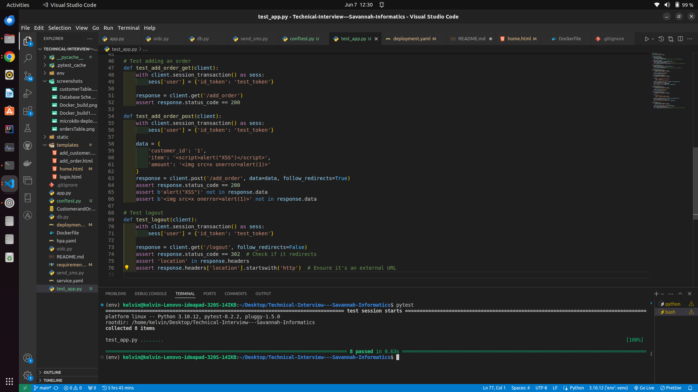


3. ### Dockerize and push the App
Built and pushed the Docker image to Docker Hub.
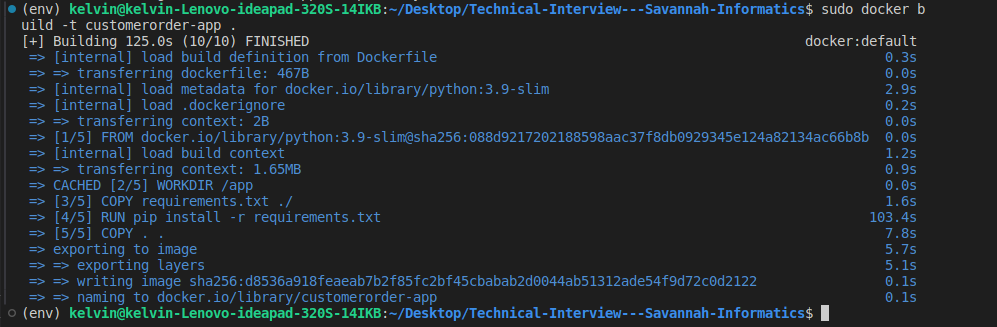

```sh
docker build -t kestack/customerorder-app:latest .
docker push kestack/customerorder-app:latest
```

4. ### Pull Docker Image on Server
SSH into my server and pulled the Docker image from Docker Hub.

```sh
docker pull kestack/customerorder-app:latest
```

### Summary for microk8s Setup

5. ### Set Up microk8s**

I installed and configured microk8s on my server to deploy the Customer Order App. The setup involved using three key configuration files:

 **deployment.yaml**: 
   - Defined the Kubernetes Deployment for the application, specifying the Docker image, replicas, and other deployment settings.

 **service.yaml**: 
   - Configured the Kubernetes Service to expose the application, facilitating network access to the app. A LoadBalancer service type was used to allow external access.

 **hpa.yaml**: 
   - Set up Horizontal Pod Autoscaler (HPA) to automatically scale the number of pod replicas based on CPU utilization, ensuring the application can handle varying loads efficiently.

These files collectively ensured a robust and scalable deployment of the application within the Kubernetes cluster managed by microk8s.

You can find the configuration file in the root directory of this project.

/deployment.yaml <br> 
/service.yaml <br> 
/hpa.yaml

6. ### Deployed the app on microk8s

Applied the deployment:

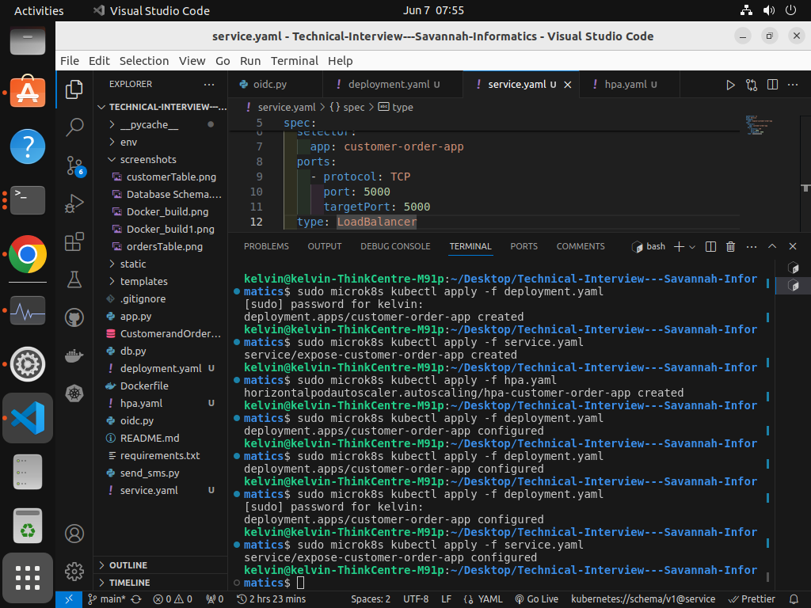


```sh
sudo docker kubectl get all -A
```

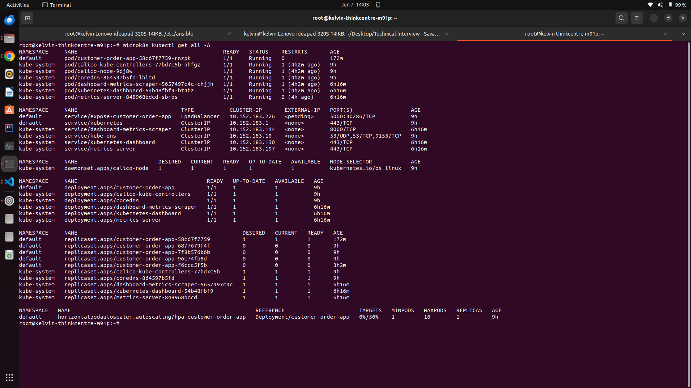

7. ### Set Up Keycloak
Used KeyCloak's documentation to get started. https://www.keycloak.org/getting-started/getting-started-docker

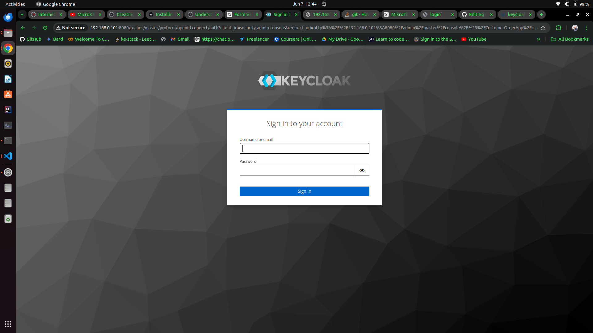

Configured KeyCloak to Athenticate and Authorize Users for my app
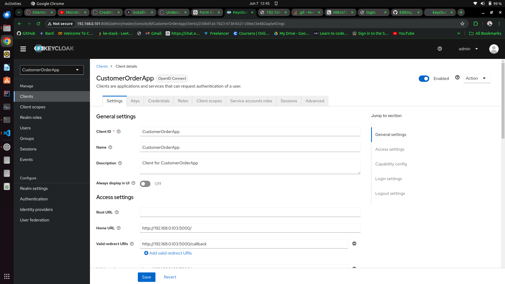

8. ### Configure MySQL
Set up a MySQL database

Created Customers Table
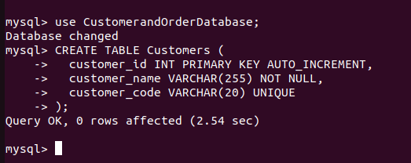

Created Orders Table
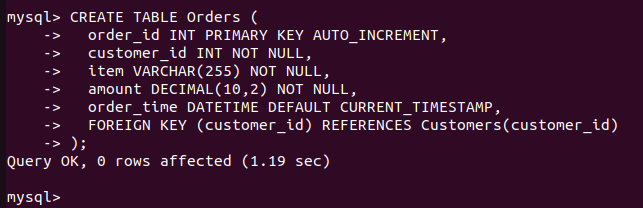

Overall Database Schema


9. Configured SMS Notifications
Set up Africa's Talking API credentials and configured my application to use these credentials for sending SMS notifications.

SMS Sent to customer after order creation
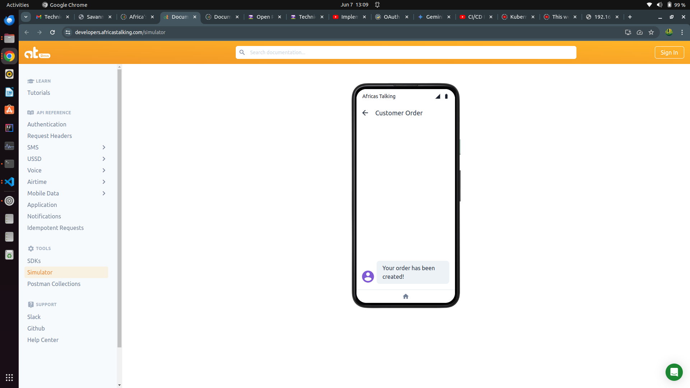

10. Configured CI/CD Pipeline with Ansible
I Set up ssh keys on my machine and the server for easier and secure communications.

I tested if I can reach my server after defining my hosts "linux" group,
```sh
ansible linux -m ping
```

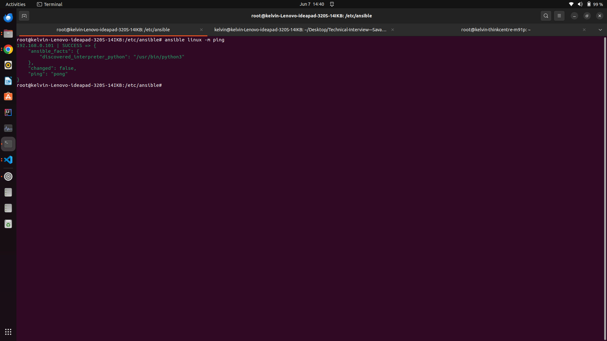


## User Journey
Login Page
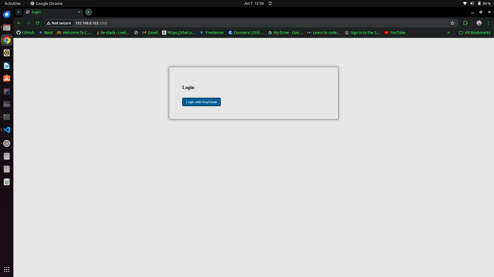

Redirected to login with KeyCloak
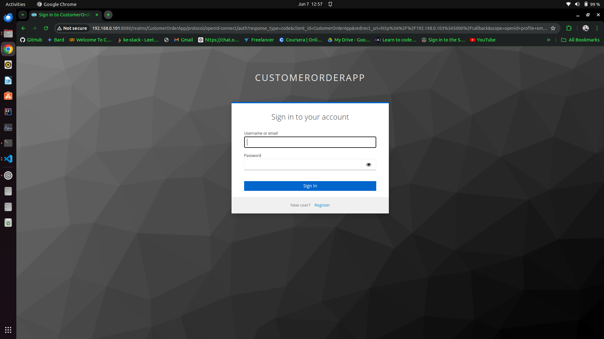

Simple Homepage
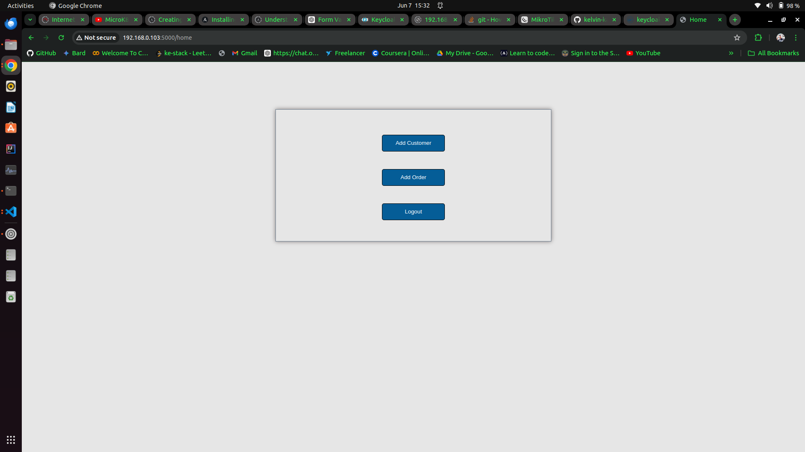

Add Customer Page
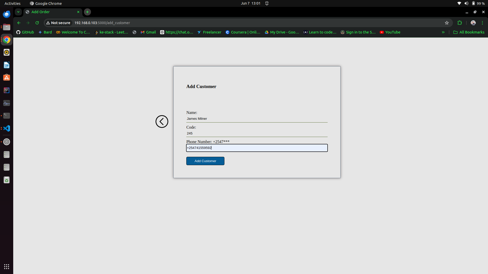

Success Adding a Customer
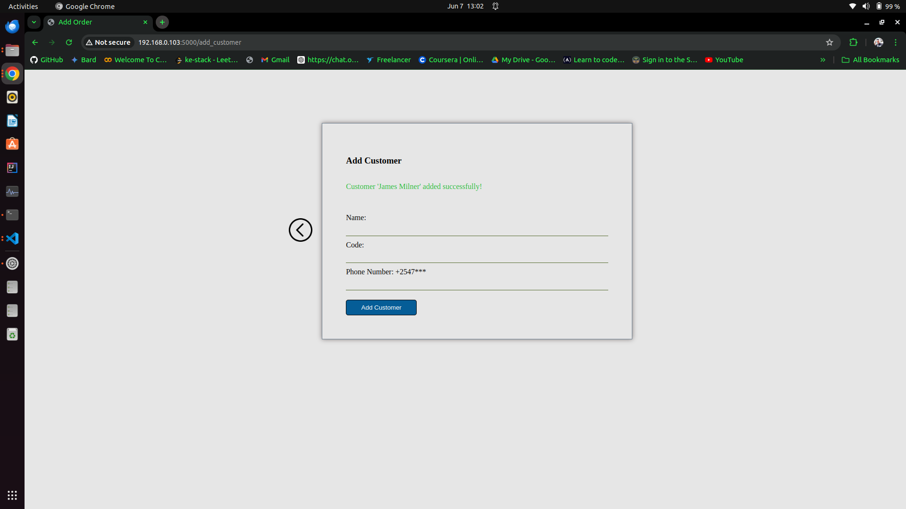

Add Order Page
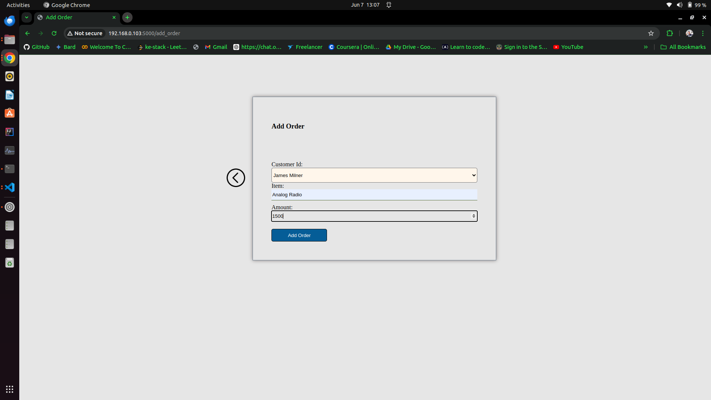

Success Adding a Page


SMS Sent to customer after order creation


## Conclusion
My Customer-Order App is set up with Docker, Microk8s, MySQL, Keycloak, and SMS integration. Continuous deployment is managed via Ansible, ensuring my app stays up-to-date with minimal manual intervention.