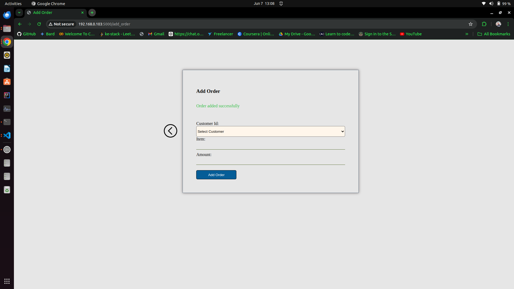

# Technical-Interview---Savannah-Informatics
This is a guide on how I accomplished the Technical assignment for the Technical Support Engineer.

The Customer Order App is a simple web application designed for managing customer orders. It has been containerized using Docker, deployed on a microk8s scalable cluster.

## Key Features
- User Authentication and Authorization: Integrated with Keycloak for secure user management.
- Data Validation: Sanitize user inputs using bleach.clean() to prevent XSS
- SMS Notifications: Sends SMS notifications to users when an order is added, using Africa's Talking API.
- Database: Uses MySQL for data storage.
- Scalability: Deployed on a microk8s Kubernetes cluster for scalability and reliability.
- Continuous Deployment: Automated updates using Ansible.

## Prerequisites
- Python
- Docker
- Docker Hub account
- microk8s installed on my server
- Ansible installed on my local machine
- MySQL database
- Keycloak server for user authentication and authorization
- Africa's Talking API credentials for SMS notifications

1. ### Testing
Tested my application's routes.
Testing files: 
- 


2. ### Dockerize and push the App
Built and pushed the Docker image to Docker Hub.


```sh
docker build -t kestack/customer-order-app:latest .
docker push kestack/customer-order-app:latest
```

3. ### Pull Docker Image on Server
SSH into my server and pulled the Docker image from Docker Hub.

```sh
docker pull kestack/customerorder-app:latest
```

4. ### Set Up microk8s
Installed and set up microk8s on my server.

5. ### Deployed the app on microk8s

Configurations files are 
-  
- 
- 

Applied the deployment:


6. ### Set Up Keycloak
Used KeyCloak's documentation to get started. https://www.keycloak.org/getting-started/getting-started-docker


Configured KeyCloak to Athenticate and Authorize Users for my app


7. ### Configure MySQL
Set up a MySQL database

Created Customers Table


Created Orders Table


Overall Database Schema


8. Configure SMS Notifications

Set up Africa's Talking API credentials and configured my application to use these credentials for sending SMS notifications.


## User Journey
Login Page


Redirected to login with KeyCloak


Simple Homepage


Add Customer Page


Success Adding a Customer


Add Order Page


Success Adding a Page


SMS SSent to customer after order creation


## Conclusion
My Customer-Order App is set up with Docker, Microk8s, MySQL, Keycloak, and SMS integration. Continuous deployment is managed via Ansible, ensuring my app stays up-to-date with minimal manual intervention.